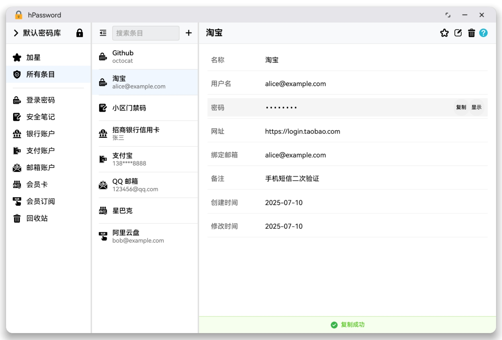

# hPassword - HarmonyOS密码管理器

一款专为HarmonyOS设计的现代化密码管理器，采用KeePass数据库格式，提供专业级的密码安全管理和多模板支持。

## 📸 应用截图

<div align="center">
  
</div>

<div align="center">
  <sub>主界面三栏布局 - 分类导航、条目列表、详情面板</sub>
</div>

## ✨ 核心功能

### 🔐 专业密码管理
- **KeePass数据库格式**：基于kdbxweb库，兼容KeePass 3.x/4.x格式，支持跨平台数据同步
- **AES-256加密**：采用AES-256加密算法和AES-KDF密钥派生，确保数据绝对安全
- **主密码保护**：单一主密码管理所有账户信息，简化记忆负担
- **自动超时锁定**：10分钟无操作自动锁定数据库，防止信息泄露

### 🗂️ 多模板分类管理
- **25种预设模板**：涵盖常见的密码管理场景
  - 登录信息、银行账户、支付账户、证券基金
  - 邮箱账户、会员卡、订阅服务、通讯录
  - 家庭信息、证书、保险、公用事业
  - 医疗记录、忠诚度计划、密钥证书、服务器
  - 数据库、物联网设备、车辆信息、路由器
  - API凭证、软件许可、加密钱包、其他
- **智能字段识别**：根据模板自动识别敏感字段并加密保护
- **自定义字段**：支持添加自定义字段，满足个性化需求

### 🎯 现代化用户界面
- **三栏式布局**：分类导航、条目列表、详情面板三栏并列显示
- **可折叠侧边栏**：支持一键隐藏分类导航，进入专注查看模式
- **智能搜索**：支持标题、用户名、备注等多字段实时搜索
- **状态记忆**：自动记住界面布局、选中项目等用户偏好

### 🔍 高级搜索功能
- **实时搜索**：输入关键词即时显示匹配结果
- **多字段搜索**：同时搜索标题、用户名、网址、备注等字段
- **搜索结果高亮**：关键词高亮显示，快速定位目标信息
- **防抖优化**：300ms防抖延迟，提升搜索响应性能

### 🌟 收藏与标记系统
- **条目收藏**：重要条目可标记为收藏，便于快速访问
- **状态管理**：支持标记条目状态，个性化管理方式
- **智能分类**：自动统计各分类条目数量，清晰展示数据分布

### 🔧 数据库管理
- **完整CRUD操作**：支持条目的创建、读取、更新、删除
- **软删除机制**：删除的条目移至回收站，防止误删
- **数据同步**：自动保存所有更改，确保数据一致性
- **备份恢复**：支持数据库文件的备份和恢复

## 🛠️ 技术架构

### 开发环境
- **HarmonyOS SDK**: 5.0.5(17)
- **开发语言**: TypeScript/ArkTS
- **架构模式**: Stage模式
- **应用版本**: 1.0.0
- **Bundle ID**: com.mznm.hpassword

### 核心技术栈
- **KeePass库集成**：基于kdbxweb库，支持KeePass 3.x/4.x格式
- **加密算法**：AES-256加密、ChaCha20流密码、Salsa20算法
- **密钥派生**：AES-KDF密钥派生函数，支持多轮加密强化
- **数据压缩**：集成fflate库，支持数据压缩存储
- **内存保护**：ProtectedValue机制，敏感数据内存加密

### 数据安全架构
- **多层加密**：数据库文件、内存数据、传输过程全方位加密
- **版本兼容**：支持KeePass 3.x/4.x格式的所有安全特性
- **安全随机数**：使用加密安全的随机数生成器
- **内存清理**：敏感数据使用完毕后立即清理内存
- **超时保护**：自动超时锁定，防止未授权访问

### 模板系统架构
- **模板引擎**：统一的模板定义和渲染机制
- **类型安全**：TypeScript严格类型检查，确保模板字段类型正确
- **字段验证**：自动验证必填字段、格式验证等
- **扩展性**：支持自定义模板和字段类型

### 技术栈实现说明

#### kdbxweb库集成
hPassword基于优秀的kdbxweb库进行开发，该库提供了完整的KeePass数据库格式支持：

- **格式兼容性**：完全兼容KeePass 3.x/4.x数据库格式
- **加密算法**：支持AES-256、ChaCha20等现代加密算法
- **内存保护**：提供ProtectedValue机制保护敏感数据
- **跨平台兼容**：与KeePass、KeePassXC等主流工具数据互通

#### 当前技术实现
- **密钥派生**：当前实现AES-KDF，具备Argon2代码框架（规划中）
- **平台优化**：针对HarmonyOS平台进行性能和兼容性优化
- **自定义扩展**：在kdbxweb基础上增加模板系统和UI组件

## 🚀 快速开始

### 系统要求
- **操作系统**：HarmonyOS NEXT 或 HarmonyOS 4.0+
- **SDK版本**：5.0.5(17) 及以上
- **存储空间**：建议预留50MB用于数据库文件
- **内存要求**：建议4GB以上内存，确保加密解密性能

### 安装部署

#### 方式一：源码编译
1. **环境准备**
   ```bash
   # 确保已安装DevEco Studio 5.0+
   # 配置HarmonyOS SDK 5.0.5(17)
   ```

2. **获取源码**
   ```bash
   git clone [项目地址]
   cd hPassword
   ```

3. **依赖安装**
   ```bash
   # 使用hvigor构建工具
   hvigor clean
   hvigor assembleHap
   ```

4. **运行调试**
   - 在DevEco Studio中打开项目
   - 连接HarmonyOS设备或启动模拟器
   - 点击运行按钮进行安装调试

#### 方式二：HAP包安装
1. 下载预编译的HAP安装包
2. 通过hdc工具安装：
   ```bash
   hdc install hPassword.hap
   ```

### 首次使用
1. **创建主密码**：
   - 首次启动自动进入密码创建流程
   - 设置至少6位字符的强密码
   - 系统自动创建默认KeePass数据库

2. **数据库初始化**：
   - 系统自动执行CRUD测试验证数据库完整性
   - 创建默认分组和示例数据
   - 显示初始化结果和测试状态

3. **开始使用**：
   - 输入主密码解锁数据库
   - 浏览预设模板分类
   - 开始添加和管理密码信息

## 📋 功能清单

### ✅ 已实现功能
- [x] KeePass 3.x/4.x数据库格式支持（基于kdbxweb）
- [x] AES-256加密和AES-KDF密钥派生
- [x] 25种预设模板分类
- [x] 三栏式响应式布局
- [x] 实时搜索和过滤
- [x] 条目收藏和标记
- [x] 密码显示/隐藏切换
- [x] 自动超时锁定
- [x] 数据库CRUD操作
- [x] 软删除和回收站
- [x] 界面状态持久化
- [x] 字段类型智能识别
- [x] 敏感数据内存保护
- [x] 完整的错误处理
- [x] 数据库完整性测试

### 🔄 开发中功能
- [ ] 条目编辑功能
- [ ] 密码生成器
- [ ] 数据导入导出
- [ ] 主题切换

### 📅 规划功能
- [ ] Argon2密钥派生函数支持
- [ ] 生物识别解锁
- [ ] 云同步支持
- [ ] 密码强度检测
- [ ] 定期密码更新提醒
- [ ] 数据库备份加密
- [ ] 多语言支持
- [ ] 密码历史记录
- [ ] 自定义模板创建
- [ ] 批量操作功能

## 📚 开发说明

### 项目结构
```
entry/src/main/ets/
├── pages/                  # 页面文件
│   ├── Index.ets              # 主页/登录页
│   └── MainPage.ets           # 主功能页面
├── utils/                  # 工具类
│   ├── DatabaseFileManager.ets # 数据库文件管理
│   ├── DefaultDatabase.ets     # 默认数据库
│   ├── KdbxCore.ets           # KeePass核心
│   ├── KdbxEntryManager.ets   # 条目管理
│   ├── KdbxGroupManager.ets   # 分组管理
│   ├── KdbxQuery.ets          # 数据查询
│   ├── KdbxTypes.ets          # 类型定义
│   ├── KdbxUtils.ets          # 工具函数
│   └── PreferencesUtil.ets   # 偏好设置
├── lib/                    # 核心库
│   ├── crypto/                # 加密算法
│   │   ├── chacha20.ts           # ChaCha20加密
│   │   ├── crypto-engine.ts      # 加密引擎
│   │   ├── key-encryptor-aes.ts  # AES密钥加密
│   │   ├── key-encryptor-kdf.ts  # KDF密钥派生
│   │   ├── protected-value.ts    # 受保护值
│   │   └── salsa20.ts           # Salsa20加密
│   ├── format/                # 数据格式
│   │   ├── kdbx.ts              # KeePass主类
│   │   ├── kdbx-credentials.ts  # 凭证管理
│   │   ├── kdbx-entry.ts        # 条目格式
│   │   ├── kdbx-group.ts        # 分组格式
│   │   ├── kdbx-format.ts       # 格式处理
│   │   └── kdbx-header.ts       # 头部信息
│   ├── errors/                # 错误处理
│   │   └── kdbx-error.ts        # 错误类型
│   └── utils/                 # 工具函数
│       ├── binary-stream.ts     # 二进制流
│       ├── byte-utils.ts        # 字节工具
│       └── xml-utils.ts         # XML工具
├── templates/              # 模板定义
│   ├── Login.ts               # 登录模板
│   ├── BankAccount.ts         # 银行账户模板
│   ├── PaymentAccount.ts      # 支付账户模板
│   └── [其他24个模板...]
└── test/                   # 测试文件
    └── DatabaseCRUDTest.ets   # 数据库测试
```

### 核心特性
- **安全优先**：采用工业级加密标准，确保数据安全
- **模板化设计**：预设模板覆盖常见场景，支持自定义扩展
- **性能优化**：内存管理、懒加载、防抖搜索等优化
- **用户体验**：响应式布局、状态记忆、智能搜索
- **代码质量**：TypeScript严格类型、模块化架构、完整测试

### 安全设计原则
1. **零信任架构**：所有数据都经过加密处理
2. **最小权限原则**：只解密当前需要的数据
3. **深度防护**：多层次安全防护机制
4. **安全编码**：避免常见的安全漏洞

## 🔧 开发贡献

### 参与开发
1. Fork 项目仓库
2. 创建功能分支 (`git checkout -b feature/SecureFeature`)
3. 提交更改 (`git commit -m 'Add some SecureFeature'`)
4. 推送分支 (`git push origin feature/SecureFeature`)
5. 开启 Pull Request

### 代码规范
- 遵循ArkTS编码规范
- 使用TypeScript严格模式
- 敏感数据必须加密处理
- 添加必要的安全注释
- 进行安全性测试

### 安全审计
- 定期进行代码安全审计
- 使用静态分析工具检测漏洞
- 及时更新依赖库版本
- 响应安全漏洞报告

## 🎯 适用场景

- **个人用户**：管理个人账户、银行卡、会员卡等敏感信息
- **专业人士**：管理工作相关的API密钥、服务器信息、证书等
- **家庭用户**：管理家庭成员的各类账户和重要信息
- **企业用户**：管理企业内部的密码和敏感信息（配合企业版功能）

## 📞 支持与反馈

- **问题反馈**：[GitHub Issues](链接地址)
- **功能建议**：[GitHub Discussions](链接地址)
- **安全问题**：service@mznm.com
- **用户手册**：[查看文档](docs/user-guide.md)

---

**守护您的数字安全！** 🔐✨

> 本项目遵循最高安全标准，持续更新以应对最新的安全威胁。如发现安全问题，请立即联系我们。 